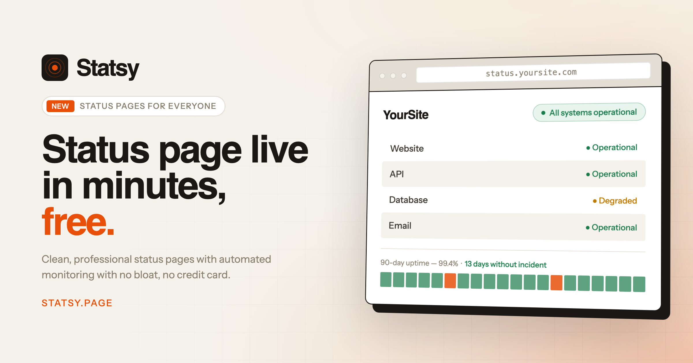

# Statsy

A simple, affordable status page tool for developers and small teams.
Live at [statsy.page](https://statsy.page)

Built and run solo from design through deployment, including payments
and uptime monitoring.

## What it does

- Create a public status page for your service in a few minutes
- Automated uptime monitoring with incident history
- Subscription billing via Paddle
- Custom domains

## Stack

- **Frontend:** Next.js, TypeScript, Tailwind CSS
- **Backend & data:** Supabase (Postgres, auth, storage)
- **Payments:** Paddle
- **Hosting:** Vercel

## Notes

This is a live product, so the repo is the real codebase rather than a
demo. I own the whole surface: schema design, API routes, the monitoring
worker, billing integration, and deployment.

---

Built by [Ferrey Adinarta](https://ferreyadinarta.vercel.app) ·
[LinkedIn](https://linkedin.com/in/ferrey-adinarta)
